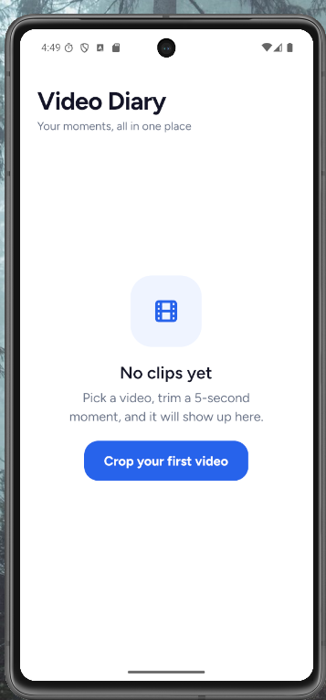
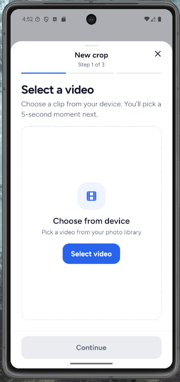
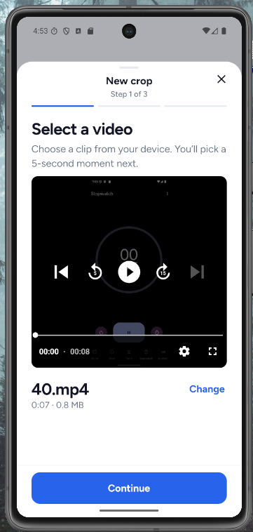
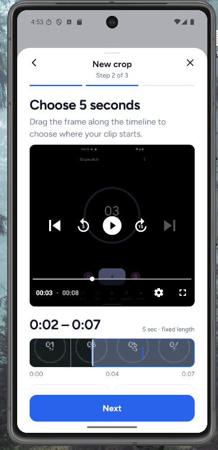
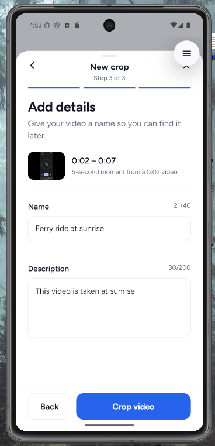
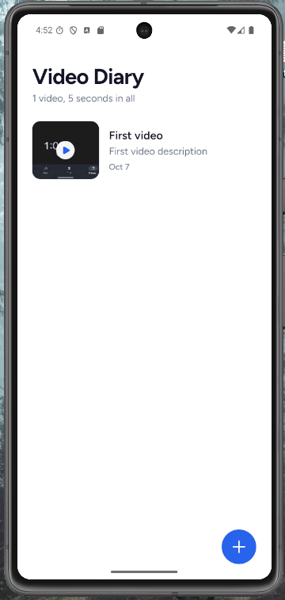
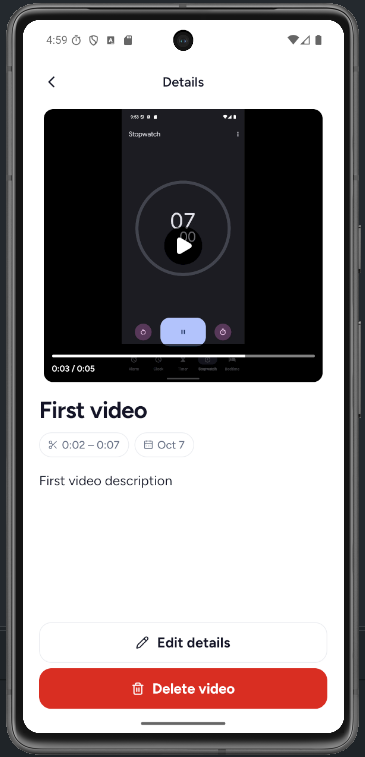
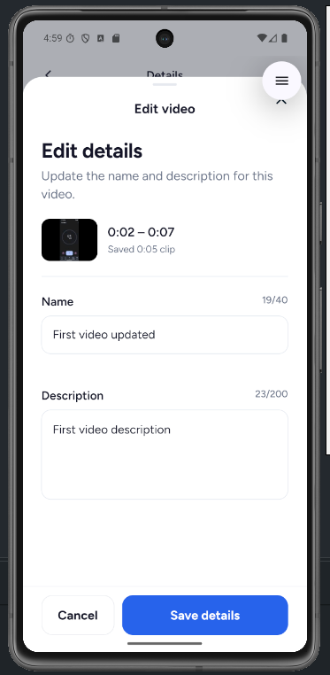
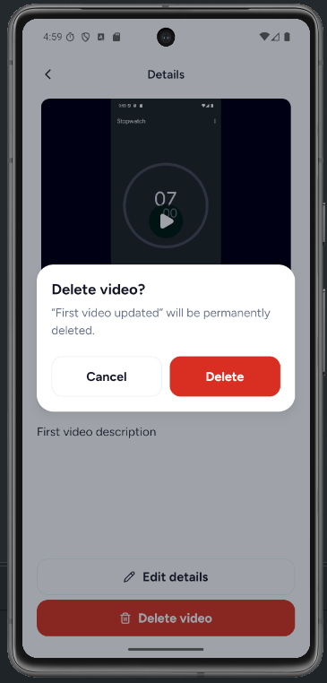
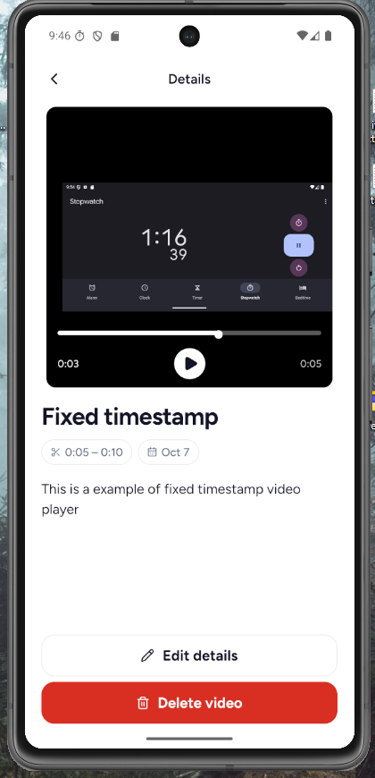

# Video Diary

A mobile app for saving five-second moments from videos on your device. Pick a video, choose where the clip starts, add a name and description, and keep the cropped clip in a local diary. You can play saved clips, edit their details, and delete them.

**Tech stack:** Expo SDK 57 · React Native · TypeScript · Expo Router · Zustand · TanStack Query · NativeWind · Expo SQLite · Zod

## Screenshots

The screenshots below follow the app flow in order.

<table>
  <tr>
    <td align="center">1. Empty diary<br></td>
    <td align="center">2. Select a video<br></td>
    <td align="center">3. Video selected<br></td>
  </tr>
  <tr>
    <td align="center">4. Choose five seconds<br></td>
    <td align="center">5. Add details<br></td>
    <td align="center">6. Video list<br></td>
  </tr>
  <tr>
    <td align="center">7. Video details<br></td>
    <td align="center">8. Edit details<br></td>
    <td align="center">9. Delete confirmation<br></td>
  </tr>
</table>

### Demo video

[Watch the app demo on YouTube](https://www.youtube.com/watch?v=bDqzcZQdYxQ)

## Setup

> **Full video cropping requires a development build.** `expo-trim-video` is not available in Expo Go. Use the `feature/expo-go` branch only to explore the screens without exporting a cropped clip.

### Requirements

- Node.js 22.13 or newer and npm
- An Android device or emulator, or an iOS device or simulator on macOS
- A native development build of this app for the complete cropping flow

### Install and run

```bash
npm ci
npx expo run:android
```

Use `npx expo run:ios` instead on macOS for iOS. The `run` command builds and installs the development app. After the first build, start the development server with:

```bash
npm run start
```

Open the installed development app on the device. Rebuild it after adding or changing a native dependency. The generated `android/` and `ios/` directories are ignored by Git; native configuration belongs in `app.json` and Expo config plugins.

### Expo Go branch

The `feature/expo-go` branch lets reviewers explore the same main screens and five-second selection preview in Expo Go. It saves the full source video because `expo-trim-video` requires native code outside Expo Go. Use `main` with a development build to test actual cropping. This branch uses Expo SDK 54, so it needs a compatible Expo Go version.

```bash
git switch feature/expo-go
npm ci
npm run start
```

Open the QR code in Expo Go. Switch back with `git switch main` when you want to test real cropping, then run `npm ci` again because the branches use different Expo versions.

## Usage

1. Tap **Crop your first video** on an empty diary, or tap **+** from the video list.
2. Tap **Select video** and choose a video from your device. The source video must be at least five seconds long.
3. Tap **Continue**. Drag or tap the timeline to choose the start of a fixed five-second clip. You can also move the start by one second with the nudge buttons.
4. Tap **Next**, enter a name and an optional description, then tap **Crop video**.
5. Tap a saved clip in the list to play it and view its details. Use **Edit details** to change its name or description, or **Delete video** and confirm to remove it.

Names are required and limited to 40 characters; descriptions are limited to 200 characters.

## How it works

- **Video processing:** `expo-image-picker` selects the source, `expo-video` previews and plays it, and `expo-trim-video` exports the selected five-second range. The cropped video and thumbnail are stored in the app's document directory with `expo-file-system`.
- **SQLite persistence:** `expo-sqlite` stores clip metadata in `video-diary.db` across app restarts. Video and thumbnail files live in the app's document directory; SQLite stores their file names.
- **Zod validation:** One shared Zod schema validates metadata during both creation and editing. It requires a name of up to 40 characters and allows an optional description of up to 200 characters. `react-hook-form` displays field errors.
- **Edit and delete:** The details screen has an edit sheet for updating the name and description in SQLite. Deletion requires confirmation and removes the database record and stored media files.
- **State and async work:** Zustand keeps the temporary crop flow state. TanStack Query handles list and detail reads, trimming and save mutations, and refreshes after changes.
- **UI:** Expo Router handles navigation, NativeWind handles styling, and React Native Reanimated animates the crop and edit sheets.

### Android playback time display

On `main`, Android's exported clip may retain the source video's timestamps. The selected footage is five seconds long, but the native player controls can show a time like `00:10 / 00:11`.

The separate [`fix/timestamp-player` branch](https://github.com/emodeth/video-diary-app/tree/fix/timestamp-player) uses custom playback controls to show time relative to the selected clip (`0:00 / 0:05`) and limits seeking to that range. The screenshot below shows that branch. The exported file's timestamps are unchanged; correcting the file itself would require rebasing timestamps in the Android export. The player fix remains on its own branch for review, and `expo-trim-video` and the package configuration have not been changed.



### Scaling the SQLite video list

The repository fetches **30 videos at a time** using a cursor made from `created_at` and `id`; the next page continues after the last row already shown. A composite index on `(created_at DESC, id DESC)` supports that ordering, including when multiple videos have the same timestamp. The home screen renders pages with React Native `FlatList` and requests another page only near the end. It gets the total video count and total duration from a separate SQL aggregate query instead of loading every row just to calculate them. SQLite runs in WAL mode, and the database schema has a versioned migration path for future changes.

## Folder structure

The app has only three routes, and pieces such as `MetadataForm`, playback, and validation are shared across flows, so code is grouped by technical responsibility. If the app grows into more independent areas, these groups can move into feature folders.

```text
assets/                  App icons and bundled visual assets
docs/screenshots/        Screenshots used in this README
src/
  app/                   Expo Router screens and root navigation layout
    index.tsx            Diary list and empty state
    crop/index.tsx       Three-step video cropping flow
    videos/[id].tsx      Saved clip details
  components/            Shared UI and screen-specific components
    home/                Diary list and empty state components
    crop/                Selection, timeline, and details steps
    videos/              Video details, edit, and delete components
  constants.ts           Clip length, metadata limits, and layout constants
  db/                    SQLite provider, migrations, and video queries
  hooks/                 Video queries and crop-flow hooks
  lib/                   Video picking, trimming, files, thumbnails, utilities
  schemas/               Zod metadata schema
  stores/                Zustand crop draft
  theme/                 Colors
  types/                 Shared TypeScript types
app.json                 Expo app configuration and plugins
package.json             Dependencies and scripts
```

## Checks

Automated tests are outside the scope of this case study. The next useful tests would cover Zod metadata validation and SQLite cursor pagination, including records with equal timestamps. The available static checks are:

```bash
npm run lint
npm run typecheck
```

For Expo SDK guidance, see the [SDK 57 reference](https://docs.expo.dev/versions/v57.0.0/) and [development build instructions](https://docs.expo.dev/develop/development-builds/use-development-builds/).
